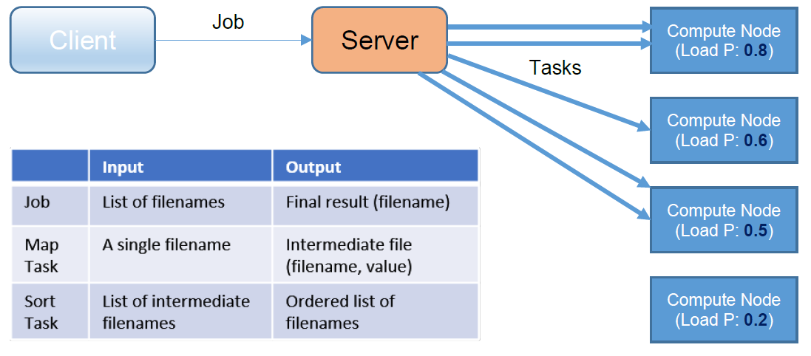

# MAP-REDUCE FRAMEWORK FOR SENTIMENT ANALYSIS USING THRIFT RPC

This system is capable of performing a simple form of Sentiment Analysis on large datasets using the Map-Reduce compute framework.
The client node sends a job to the server node with a list of files, which the server on the basis of scheduling policy sends for the map tasks in multi-threaded environment and assigns to
each compute node, who are capable of performing sentiment analysis on each file and store the scores in the intermediate files. 
Once the map task is completed and the scores are being calculated, the server assigns the sort task to one compute node which sorts the sentiment scores in decreasing order and stores it in the output file which is accessible to the client.

Each Compute Node is allotted a Load Probability to reject tasks if using Load Balancing scheduling and also for injecting loads
through configurable delays.

## SAMPLE DATA

Some sample data has been provided in the ./data folder. It also contains sample positive and negative vocabulary files.

## CONFIGURATION AND INSTRUCTIONS

Running the Code
A config.file is provided which specifies the following:
* First line mentions the scheduling policy. (0-RANDOM 1-LOAD BALANCING)
* Second line mentions the port numbers. (9106-Client-Server, 9107-Server-WorkerNode) which is separated by a single space
* From third line on, each line has a description of the hostnames and load value of each WorkerNode, separated by a single space.
  (e.g csel-kh4250-06.cselabs.umn.edu 0.2) 
  Note: All the values are separated by a single space.

To run the code, we need to follow the following steps:
(Everything needs to be run from the directory in which the files are present)

* We first compile the project using the following syntax :\
javac -cp ".:/usr/local/Thrift/*" *.java -d .

* Then we ssh into the WorkerNodes mention in the config file by ssh-ing into the CSE lab machines.\ For example, we ssh on 4 machines for running 4 individual worker nodes. 

* We then run the WorkerNodes individually using the following command \
java -cp ".:/usr/local/Thrift/*" WorkerNode

* We then run the Server on the local node using: \
java -cp ".:/usr/local/Thrift/*" Server

* Next, we then run the Client on the local node to run the entire Map-Reduce functionality: \
java -cp ".:/usr/local/Thrift/*" Client

